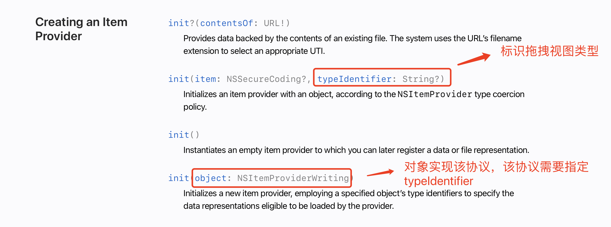

## 效果

## 目标
* 构造NSItemProvider
* DropDelegate委托中各个方法的含义

## 代码
https://github.com/yuanzj/drag-drop
## 正文
拖放操作分为两步拖动(drag)和放下(drop)
### drag
让一个视图可以拖动非常简单增加一个`onDrag()`修饰符就OK了。
```swift
func onDrag(_ data: @escaping () -> NSItemProvider) -> some View
```

在drag修改器中需要返回NSItemProvider对象，NSItemProvider对象的作用是描述当前拖动视图的类型并且可以传递一些信息。

NSItemProvider初始化方法：


在本示例中代码如下：
```swift
.onDrag {
	todoList.draggedItem = item
	return NSItemProvider(item: nil, typeIdentifier: TodoList.typeIdentifier)
}
```
### drop
对于放下部分，SwiftUI 有一个名为`onDrop()`的修饰符。在放下的区域增加这个修饰符即告诉 SwiftUI 当前区域可以接纳哪些类型的视图放下，DropDelegate可以处理放下的各个环节。

```swift
/// supportedTypes 支持的拖拽视图类型
/// delegate 放下处理委托
func onDrop(of supportedTypes: [String], delegate: DropDelegate) -> some View
```
#### supportedTypes
与drag修饰符中返回的NSItemProvider对象中的typeIdentifier对应表示当前区域可以接受该视图放下。

#### DropDelegate
```swift
public protocol DropDelegate {

	/// 验证放下（进入可放下区域时触发回调）
	func validateDrop(info: DropInfo) -> Bool
	
	/// 放下完成（手指离开了屏幕或者鼠标弹起完成了拖放操作时触发回调）
	func performDrop(info: DropInfo) -> Bool
	
	/// 经过验证拖拽视图进入了可放下区域
	func dropEntered(info: DropInfo)
	
	/// 描述放下的行为 缺省返回nil(拖拽视图进入可放下区域后在可放下区域内移动时触发回调)
	func dropUpdated(info: DropInfo) -> DropProposal?
	
	/// 离开了可放下区域
	func dropExited(info: DropInfo)

}
```
## 尾巴
在本章我们看到实现拖放功能是如此的简单。只需要正确定义NSItemProvider，在DropDelegate的委托方法中按照需求完成视图更新即可。